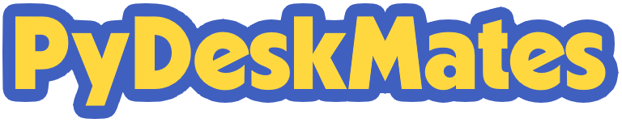

<h1 align="center"></h1>

An incomplete remake of Oska Software's DeskMates in Python.

<h2>What are DeskMates?</h2>

DeskMates are animated characters that live their own lives right on your desktop. You can launch the selected
character and just watch their various sequences, or you can take an active part in them. Clicking on different parts of
the character's body will cause them to have different reactions. There are also very small secret touch reactions
(up to 1 pixel).

<h2>Things to be added</h2>
<ul>
<li>Touch reaction with hotspots</li>
<li>Recursive sequence parsing
<ul>
<li>Frame range: a numeric string range of frames. It could be either forwards or backwards.

Example:

    0881-0895
</li>
<li>Frame group: parts enclosed in parentheses.</li>
<li>Repeats: a frame/group followed by an asterisk and a number.

Examples:

    0000*5
    (0192-0201)*10
</li>
<li>Playing the sound effect: a name of the sound effect is preceded by a space and an exclamation point (" !", or
0x2021 in hex). Must be contained in the frame group. If the previous sound is currently playing, the animation has to
pause till the former ends before playing the next one.

Example (from the DESKMATE.FAS file of the old Oska DeskMate version from May 21, 1999):

    ( !FLAP,1218,1220,1218,1219)
</li>
<li>Weighted random choices: parts followed by a percentage symbol and a number,
separated with '|' delimiters and enclosed in curly brackets.

Example (from the common_demo.FAS file of the Kahli DeskMate):
        
    {pause_chair%4|pause_ice|pause_metalsuit_a|pause_metalsuit_b%4|pause_orb%3|pause_treadmill%4}
It will randomly pick either "pause_chair", "pause_ice", "pause_metalsuit_a", "pause_metalsuit_b", "pause_orb", or
"pause_treadmill" with probabilities of [4, 1, 1, 4, 3, 4].
</li>
<li>Relative position: numbers representing coordinates in a Cartesian coordinate system, enclosed in square brackets.
Example:

    [15,8]
</li>
<li>Fencing region: numbers representing coordinates of the region (where a character will be repositioned)
in a Cartesian coordinate system, enclosed with copyright symbols (&#169;, 0xA9 in hex). A digit before the letter can
be set to:
<ul><li>0 &mdash; stay in the region</li><li>1 &mdash; move to the last saved position</li>
<li>2 &mdash; unknown functionality</li>
<li>3 &mdash; move to the parent sprite</li>
</ul>

It is formatted like: &#169;[x1,y1]0h0v,[x2,y2]0h0v&#169;.

Example:

    ©[-100,100]0c0m,[100,-100]0c0m©
...will set the first point of the region to the center (center-middle) of the screen with the offset of (-100,-100)
and the second one to the center (center-middle) of the screen with the offset of (100,100), and re-position the
character to be in the set region.
</li>
<li>Flipping: The following frames can be flipped either horizontally or vertically by adding either the caret (^,
0x5E in hex) or the "less-than" symbol (&lt;, 0x3C in hex), respectively. Introduced in the Maeka DeskMate.</li>
<li>Random floating: This part will make the character float around at random in the region with set maximum horizontal
and vertical speeds. It's useful if you don't feel like adding relative positioning to every frame. It is preceded by
the section sign (&sect;, 0xA7) and values are separated by the forward slash
(/), and the result would be like this: &sect;h/v. Introduced in the Johlee DeskMate.
<li>Extra sprite: The parts are preceded either by a single number sign (#) for absolute positioning or two number
signs (##) for relative positioning. Introduced in Sugar-n-Spice.</li>
<li>Timer: The sequence will be repeated for a set number of frames or more. The part is followed by the "at" symbol (@)
and a number of frames. Introduced in Dancing Girls.

Example (taken from the dance_cheerleader.FAS file of the Dancing Girls DeskMate):

    float_loop_cheerleader@1000
</li>
<li>Loading external FAS file: the specific FAS file is loaded. The part (filename) is preceded by the underscore (_).
Introduced in Tahni 3D.

Example:

    _T3D_cage (loads "T3D_cage.fas")
</li>
<li>Masking: The sequence is preceded by the symbol &#189; (0xBD in hex) for masking the parent sprite. Introduced in
Screen Sirens.

Example (taken from the sfx_iris.FAS file of the Kahli 3D DeskMate):

    ½9198,9100,9102,9104,9106,9108,9110,9112,9199
</li>
</ul>
</li>
</ul>
<h2>Things to be improved</h2>
<ul><li>Better image rendering</li></ul>
